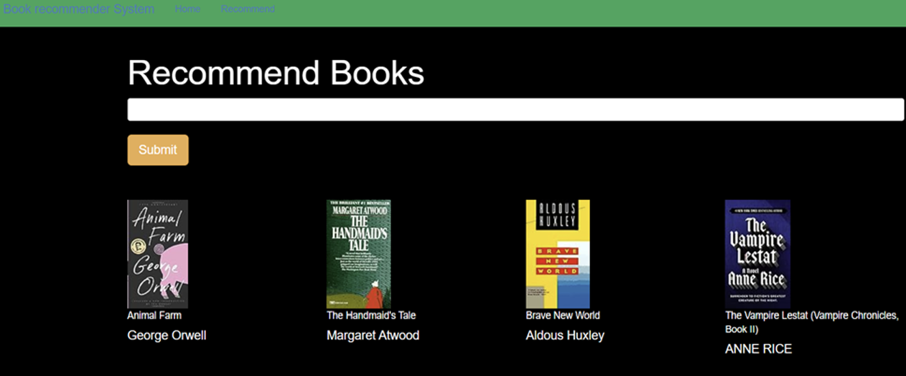
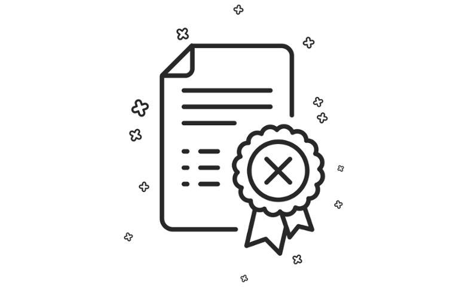

<h1 align="center">Hi 👋, I'm Sindhuvyshnavi Kodakandla</h1>
<h3 align="center">Full-stack Developer</h3>

  

- 📫 Reach me via **sindhuvyshnavi13@aogjob.com**

<h3 align="left">Connect with me:</h3>

<h3 align="left">Languages and Tools:</h3>

                     

##  Experience

###  Full-stack Developer at PTC                                                                                                                                                                                                   June 2023 - Present

The company offers software solutions to its customers in industrial IoT and product lifecycle management (PLM).

The main goal of our project is to optimize the CRM system to improve its performance and enhance the user experience ensuring efficient data communication and integration.

Utilized JAVA and Spring Boot as the main technologies for handling the business logic, data processing, and communication with the database

Hibernate helps in managing the data access layer which includes the interaction with the databases(MYSQL and Oracle) for data retrieval and storage

It involves the spring security which adds protection to sensitive data and resources.

Developing high-performance RESTful APIs to ensure efficient communication which can increase data retrieval speed by 25%

Optimized complex SQL queries and JDBC operations, enhancing database interaction efficiency and cutting data retrieval times by 25%. Achieved this by restructuring database schema and optimizing query execution plans using MySQL and Oracle databases.

### Full stack developer at Sigma Info Solutions, Bengaluru, India                                                                                                                                                             August 2020- July 2022
Engineered responsive web applications using HTML, CSS, JavaScript, and Angular enhancing user interfaces and user 
experience, which led to a 30% increase in user engagement.

Created scalable and secure RESTful APIs to facilitate seamless client-server communication using Java and Spring 
Boot, improving API response times by 20% and ensuring high reliability and scalability of backend services.
Constructed database schemas, wrote and optimized complex SQL queries, and managed database interactions 
using MySQL, PostgreSQL, Hibernate, and JDBC, reducing data retrieval times by 25% and improving overall 
database efficiency.
• Implemented CI/CD pipelines using Jenkins, Docker, Kubernetes, and Git to automate build, test, and deployment 
processes, decreasing deployment time by 50% and reducing post-release defects by 35% through automated testing 
and continuous integration practices.
• Participated in Agile/Scrum ceremonies, engaged in sprint planning, daily stand-ups, and retrospectives using JIRA
and Confluence, significantly improving team productivity and project delivery timelines.

##  Highlighted Projects💡

# [Book-recommendation System](https://github.com/kodakandlasindhu/Book-Recommendation-System) 

The system helps the users in finding a good set of books based on the user's interest. The system uses a collaborative filtering technique that can choose the right book for the user. The system will also display the top trending books along with personalized recommendations. The system keeps on learning based on real interest and gradually filters the books

Users can search the book either by title or genre. The objective is to improve reader enjoyment and advance literacy. Users can also contribute to the system by rating the books they read which helps in community assistance.

# Certifications 

•	Front-end Development by meta on Coursera

•	Spring Boot certification by udemy
